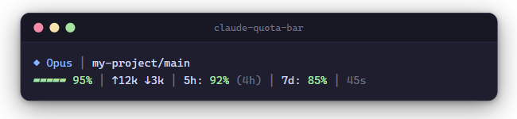
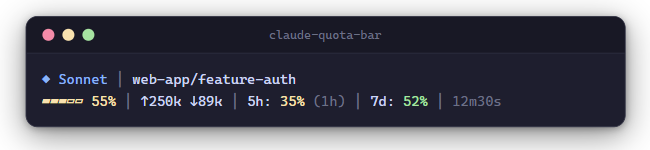
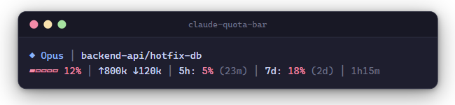
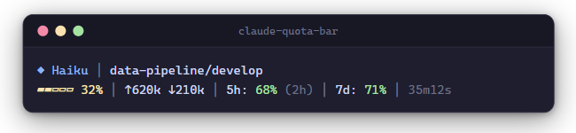
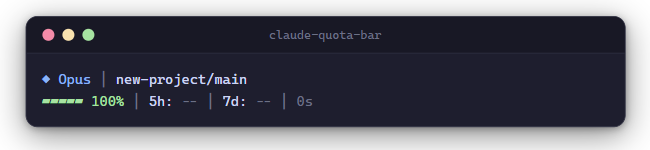

# claude-quota-bar

A real-time statusline plugin for [Claude Code](https://docs.anthropic.com/en/docs/claude-code) that shows your 5-hour and 7-day quota remaining percentages, context window usage, token counts, and reset countdowns — right in your terminal.

Never get surprised by rate limits again.

---

## Showcase

### Healthy — plenty of quota remaining



### Moderate — usage climbing



### Critical — nearly exhausted



### Heavy Context — deep in conversation



### Fresh Session — no data yet



---

## What you get

```
◆ Opus │ my-project/main
▰▰▰▰▱ 75% │ ↑50k ↓12k │ 5h: 80% (1h) │ 7d: 34% │ 2m0s
```

| Segment | Description |
|---|---|
| `◆ Opus` | Active model |
| `my-project/main` | Project name + git branch |
| `▰▰▰▰▱ 75%` | Context window remaining (5-block gauge) |
| `↑50k ↓12k` | Input/output tokens this session |
| `5h: 80%` | 5-hour quota remaining % |
| `(1h)` | Time until 5h window resets |
| `7d: 34%` | 7-day quota remaining % |
| `2m0s` | Session duration |

### Color coding

| Color | Meaning |
|---|---|
| **Green** | > 30% remaining — you're good |
| **Yellow** | 10–30% remaining — slow down |
| **Red** | < 10% remaining — close to rate limit |

---

## Installation

### Prerequisites

- [Claude Code CLI](https://docs.anthropic.com/en/docs/claude-code) with an active subscription
- Python 3.10+
- Git Bash (Windows) or any Unix shell (macOS/Linux)

### Setup

**1. Clone the repo**

```bash
git clone https://github.com/aiedwardyi/claude-quota-bar.git
cd claude-quota-bar
```

**2. Add to Claude Code settings**

Open `~/.claude/settings.json` and add (or update) the `statusLine` block:

```json
{
  "statusLine": {
    "type": "command",
    "command": "bash /path/to/claude-quota-bar/statusline.sh",
    "padding": 0
  }
}
```

Replace `/path/to/claude-quota-bar` with the actual path where you cloned the repo.

**3. That's it.** Restart Claude Code and the statusline appears automatically.

---

## How it works

1. Claude Code pipes session JSON (model, context window, tokens, cost) to `statusline.sh` via stdin
2. `statusline.py` parses the session data and reads your OAuth token from `~/.claude/.credentials.json`
3. Calls the Anthropic usage API (`/api/oauth/usage`) to fetch your current 5h and 7d quota utilization
4. Caches the API response to `/tmp/claude-sl-usage.json` for 5 minutes to avoid excessive calls
5. Outputs a two-line ANSI-colored statusline

### Caching

API responses are cached for **5 minutes** in `/tmp/claude-sl-usage.json`. A file-based lock (`/tmp/claude-sl-usage.lock`) prevents concurrent API calls. The cache is refreshed automatically in the background when stale.

### Authentication

The plugin reads your OAuth token from Claude Code's credential store at `~/.claude/.credentials.json` (key: `claudeAiOauth.accessToken`). You can also set `CLAUDE_CODE_OAUTH_TOKEN` as an environment variable to override.

---

## Compatibility

| Platform | Shell | Status |
|---|---|---|
| Windows 11 | Git Bash | Tested |
| macOS | zsh / bash | Should work |
| Linux | bash / zsh | Should work |

The script forces UTF-8 output encoding to handle Unicode gauge characters on Windows.

---

## Configuration

No configuration needed beyond the `statusLine` entry in settings.json. The plugin automatically:

- Detects your active model
- Reads the current git branch from your project directory
- Fetches quota data using your existing Claude Code credentials
- Color-codes everything based on usage severity

---

## Troubleshooting

**Statusline shows `5h: -- │ 7d: --`**
The API hasn't been called yet or the cache is stale. Wait a few seconds — the first call happens in the background and results appear on the next refresh.

**Unicode characters look broken**
Make sure your terminal supports UTF-8. On Windows, Git Bash works out of the box. If using cmd.exe or PowerShell, run `chcp 65001` first.

**No statusline appears at all**
Check that `statusLine.command` in `~/.claude/settings.json` points to the correct path and that `bash` is available on your PATH.

---

## License

MIT

---

## Contributing

Issues and PRs welcome at [github.com/aiedwardyi/claude-quota-bar](https://github.com/aiedwardyi/claude-quota-bar).
